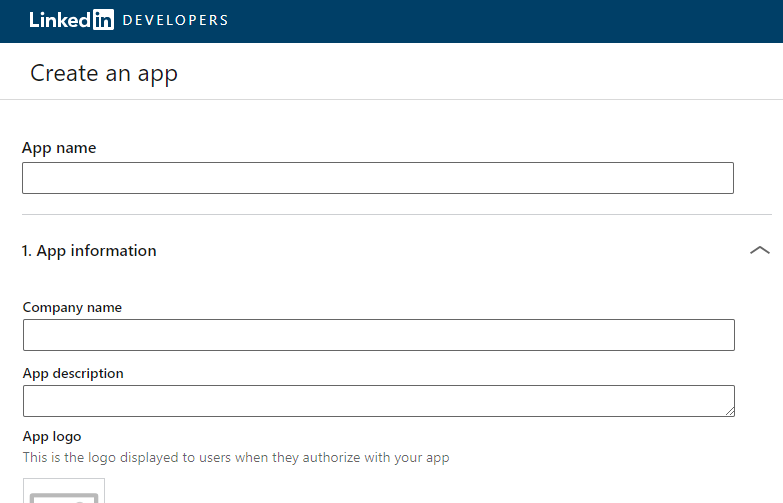

# Linkedin-Laravel-6.0

<u>Linkedin Laravel 6.0 Login</u>

## Contents which is I have followed to create this repository.

* Install Laravel 6.0 App
* Setup Database
* Download Socialite Pacakage
* Get Secrets from Linkedin
* Make Route
* Create Controller & Methods
* Create Blade View
* Start Development Server

### Take clone of this repository.

<code>git clone https://github.com/dekts/Linkedin-Laravel-6.0.git</code>

copy `.env.example` to `.env`

setup `DB_*` and `LINKEDIN_*` parameters

### Get Secrets from Linkedin

First of all We need to required `CLIENT ID` and `CLIENT SECRET` for add social Linkdin login button in laravel based project, Lets go to https://www.linkedin.com/developers/apps/new and create a new app. We have put app name, logo, email on this page :

After suceesffully create the app set the redirect url for example :

You will see your dashboard. Now get the following `CLIENT ID` and `CLIENT SECRET`.

### Next migrate the table using the below command :

<code>php artisan migrate</code>

### Start Development Server

`php artisan serve`

> SCREEN 1: Landing page

> SCREEN 2: Registration page

> SCREEN 3: Login page

## <b>Cheers! Have a joyful day.</b>